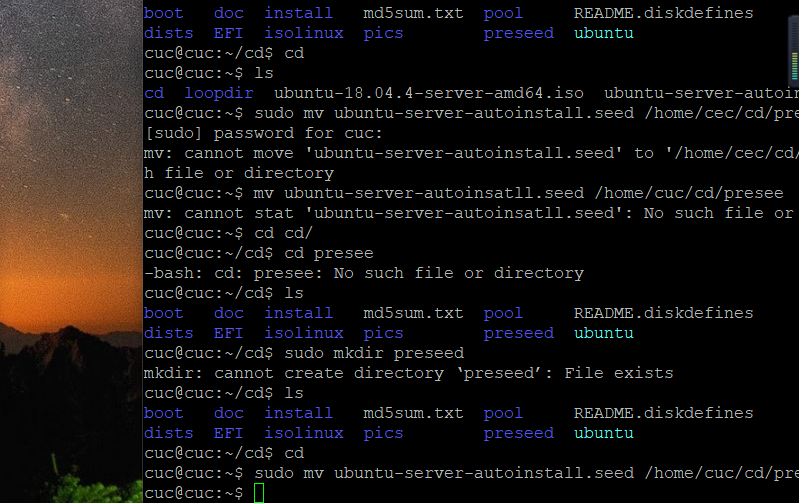
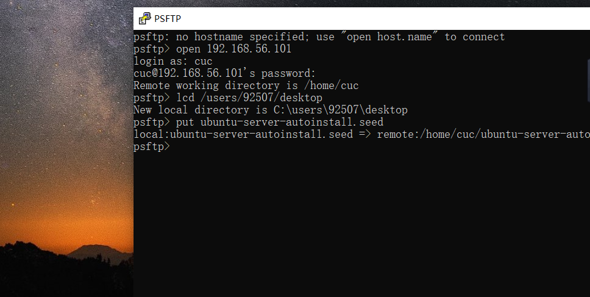
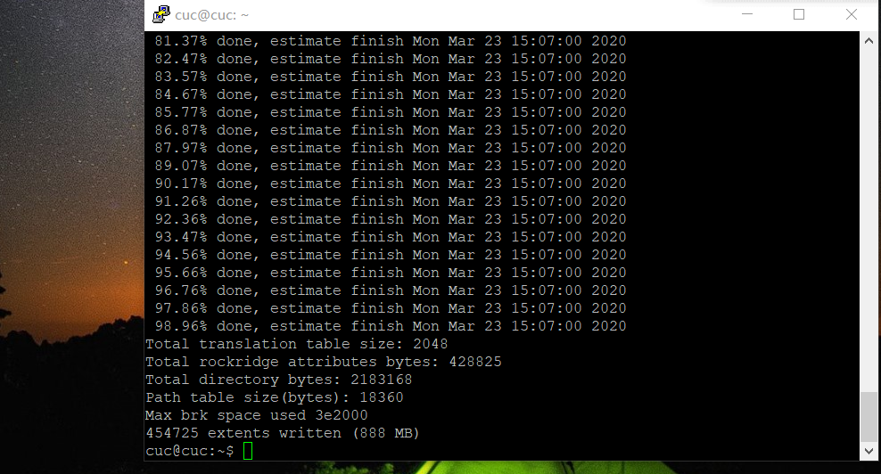
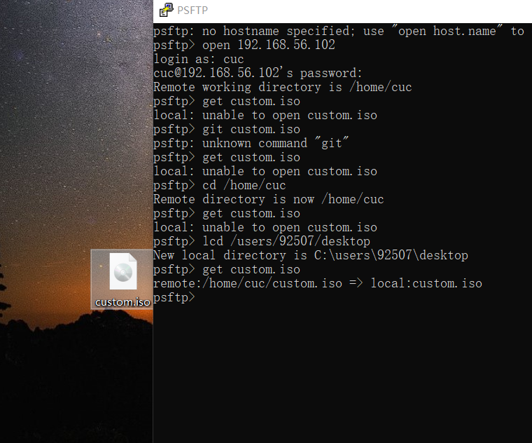
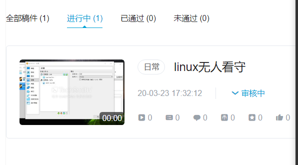

作业1

要求要求：

- 定制一个普通用户名和默认密码
- 定制安装OpenSSH Server
- 安装过程禁止自动联网更新软件包

## 1网卡配置(双网卡)
添加Host-only网卡后，输入ifconfig发现host-only网卡并未启动，使用命令
sudo ifconfig enp0s8 up
sudo dhclient enp0s8后再次ifconfig查看enp0s8  ip

## 2安装ssh，连接putty，
（遇到问题 ssh无法使用 ）
通过sudo apt-get update，sudo apt-get upgrade，sudo apt-get install openssh-server
使ssh能够正常使用 
使用PuTTY，填写虚拟机enp0s8的ip地址保存后，连接

## 3 镜像装载
- 使用psftp将ubuntu18.04.4传入虚拟机

对虚拟机进行挂载操作
- 创建一个用于挂载iso镜像文件的目录
mkdir loopdir

- 挂载iso镜像文件到该目录
Sudo mount -o loop ubuntu-18.04.4-server-amd64.iso loopdir

- 创建一个工作目录用于克隆光盘内容
mkdir cd

- 同步光盘内容到目标工作目录（注意/ 与 cd之间空格）
rsync -av loopdir/ cd

- 卸载iso镜像
Sudo umount loopdir

- 进入目标工作目录
cd cd/

## 4 修改isikinux文件夹中的txt.cf
编辑Ubuntu安装引导界面增加一个新菜单项入口
vim isolinux/txt.cfg

在第二行default下添加以下内容到该文件后强制保存退出
label autoinstall
  menu label ^Auto Install Ubuntu Server
  kernel /install/vmlinuz
  append  file=/cdrom/preseed/ubuntu-server-autoinstall.seed debian-installer/locale=en_US console-setup/layoutcode=us keyboard-configuration/layoutcode=us console-setup/ask_detect=false localechooser/translation/warn-light=true localechooser/translation/warn-severe=true initrd=/install/initrd.gz root=/dev/ram rw quiet

## 5 添加preseed文件
在本地新建一个文本文档，把老师提供的ubuntu-server-autoinstall.seed的内容复制到里面，命名为ubuntu-server-autoinstall.seed(后缀名别忘了改)。然后用PSFTP上传
把ubuntu-server-autoinstall.seed传到虚拟机，再mv到/home/cuc/cd/preseed下面

## 6 修改isolinux.cfg

将timeout 300 改为timeout 10。

## 7 重新生成MD5校验和

先使用命令下载genisoimage（不然会不成功）
再重新生成custom.iso
IMAGE=custom.iso
BUILD=cd/
sudo mkisofs -r -V "Custom Ubuntu Install CD" \
-cache-inodes \
-J -l -b isolinux/isolinux.bin \
-c isolinux/boot.cat -no-emul-boot \
-boot-load-size 4 -boot-info-table \
-o $IMAGE $BUILD

## 8 移动custom.iso
运用psftp功能将镜像移动到桌面

## 定制好的seed和官方事例文件进行对比
使用vimdiff来进行对比（部分差异作用）：
1.11行，改变额外可选的地区和语言，跳过安装时选择语言
2.49行，禁止网络自行进行配置
3.60行-64行，配置网络
4.76行,设置主机名
5.371行，禁止软件自动升级
6.379行，更新安全软件

## 参考资料

<https://github.com/CUCCS/linux-2019-cloud0606/blob/lab1/lab1/%E5%AE%9E%E9%AA%8C%E6%8A%A5%E5%91%8A.md>
<https://blog.csdn.net/m0_37657556/article/details/84062248>
<https://blog.csdn.net/qq_31989521/article/details/58600426>
<https://www.yuque.com/c4pr1c3/linux/xx2ca1>

## 录屏
b站未审核通过 正在审核中。已上传压缩包自动镜像.zip.

